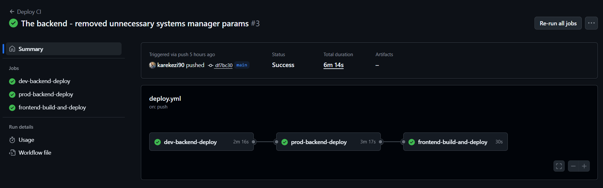
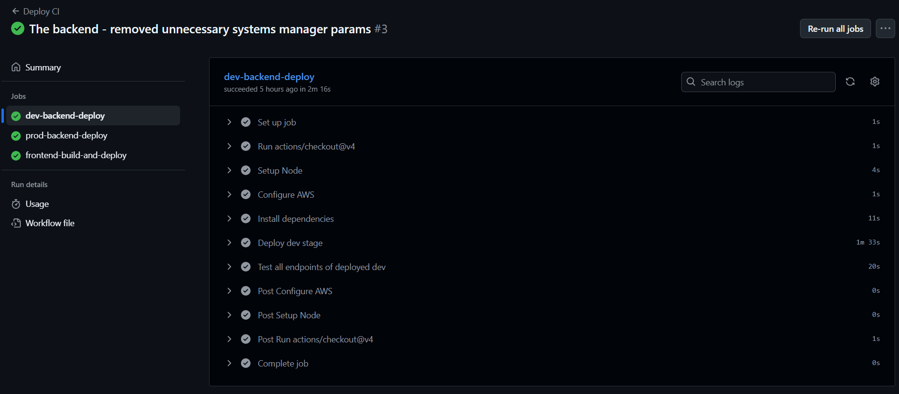
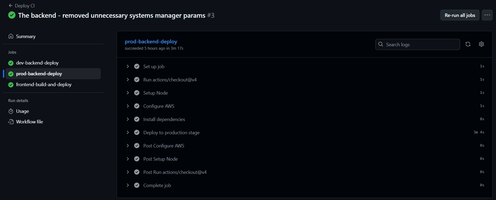
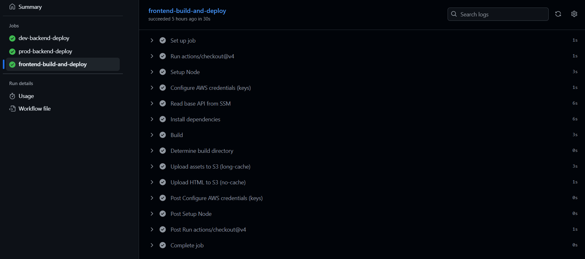

# ZoomMate — Groups, Events & Interest Matching (AWS Serverless + Node + React)

A full‑stack app for discovering people with shared interests, forming groups, and organizing events.  
Frontend is a modern React + Vite + Tailwind SPA with Redux Toolkit.  
Backend is an AWS Serverless stack (API Gateway + Lambda on Node.js 22 + DynamoDB + Cognito).


---

## Quickstart

### Dev deployment
```bash
# 1) Backend (deploy to AWS)
cd backend
npm i
# Configure AWS credentials (Admin or deploy role) first
npx serverless deploy --stage dev --region ap-southeast-2

# 2) Frontend 
cd ../frontend
npm i
npm run dev

```

### Production deployment
```bash
# Push the app to git hub to trigger the work flow
push -u origin main
```
---

## Monorepo Layout

```
zoommateapp/
├─ backend/                # Serverless stack: API Gateway + Lambda + DynamoDB + Cognito
│  ├─ serverless.yml       # Infra + routes + resources (tables, user pool, triggers)
│  ├─ config/
│  │  ├─ iam.yml/          # AWS Identity and access management defined
│  │  ├─ custom.yml/       # defined custom variables
│  │  ├─ environment.yml/  # environement variables 
│  │  ├─ functions.yml/    # functions, packaging, environement, and iam
│  │  ├─ resources.yml/    # defined resources
│  ├─ src/
│  │  ├─ auth/             # signup, signin, signout, confirm, resend, delete-self
│  │  ├─ users/            # getUsers, getUser(me), updateUser, searchUsers
│  │  ├─ groups/           # CRUD for groups
│  │  ├─ groupMembers/     # join/leave/list members
│  │  ├─ events/           # CRUD for events; listByGroup
│  │  ├─ eventAttendees/   # RSVP, un-RSVP, list attendees
│  │  ├─ triggers/         # Cognito PostConfirmation → seed Users table
│  │  └─ _utils.js         # shared helpers (ddb client, auth token parsing, error mapping, etc)
│  └─ package.json
│
└─ frontend/               # React + Vite + Tailwind + React Router + Redux Toolkit
   ├─ src/
   │  ├─ app/store.js      # Redux store
   │  ├─ features/         # RTK slices & lightweight services (axios)
   │  │  ├─ auth/          # authSlice + authService
   │  │  ├─ users/         # userSlice + userService
   │  │  ├─ groups/        # groupSlice + groupService
   │  │  ├─ groupMembers/  # memberSlice + memberService
   │  │  ├─ events/        # eventsSlice + eventsService
   │  │  └─ eventAttendees/# attendeesSlice + attendeesService
   │  ├─ pages/            # Login, Signup, VerifyCode, Profile, Account
   │  ├─ components/       # UI building blocks (ProtectedLayout, PrivateRoute, etc.)
   │  └─ _utitls.js        # simple UI validators
   ├─ package.json
   └─ .env                 # VITE_BASE_API for axios base URL
```

---

## Features

- Email/password auth via **Amazon Cognito** with post‑confirm trigger that seeds a **Users** record.
- JWT‑protected **REST API** on **API Gateway + Lambda (Node.js 22)**.
- **DynamoDB** data model for Users, Groups, Group Members, Events, Event Attendees.
- React SPA with **React Router** (protected routes) and **Redux Toolkit** slices per domain.
- **Tailwind CSS** UI with light/dark theme toggle and reusable components.
- Clean error mapping from Cognito/DynamoDB to friendly HTTP responses.

---

## Architecture

```
[React + Vite SPA]  <--axios-->  [API Gateway /{stage}]
      |                                |
      | Authorization: Bearer <Cognito Access Token>
      v                                v
  Protected Routes                [AWS Lambda (Node 22)]
                                        |
                              [DynamoDB tables + Cognito]
```

### AWS Resources (from `serverless.yml`)

- **Cognito User Pool** + **SPA Client**; **PostConfirmation** Lambda trigger creates the initial user item.
- **DynamoDB Tables**
  - `users` (PK: `userId`, GSI on `email`)
  - `groups` (PK: `groupId`, GSI on `ownerId`)
  - `group-members` (PK: `groupId`, SK: `userId`)
  - `events` (PK: `eventId`, GSI on `groupId`)
  - `event-attendees` (PK: `eventId`, SK: `userId`)
- **IAM**: least‑privileged actions for Cognito + DynamoDB + SSM Parameter read (for base API).
- **Runtime**: `nodejs22.x`

## Data Model (practical fields)

### Users
- Keys: `userId` (Cognito `sub`), `email`
- Common profile fields (supported by backend update/search):
  - `bio`, `firstName`, `lastName`, `gender`, `pronouns`,
  - `maritalStatus`, `employmentStatus`, `jobTitle`, `company`, `industry`,
  - `yearsExperience` (number),
  - `hobbies[]`, `sports[]`, `interests[]`,
  - `website`, `linkedin`, `twitter`,
  - `preferredMeetingTimes`
- Timestamps: `createdAt`, `updatedAt`

### Groups
- Keys: `groupId`
- Fields: `ownerId`, `name`, `description`, `tags[]`, `createdAt`, `updatedAt`

### Group Members
- Keys: `groupId` + `userId`
- Fields: `joinedAt`

### Events
- Keys: `eventId`
- Fields: `groupId`, `title`, `description`, `startsAt` (ISO), `endsAt` (ISO|null),
  `location`, `capacity` (number), `attendeesCount`, `isCanceled` (bool), `createdBy`, `createdAt`, `updatedAt`

### Event Attendees
- Keys: `eventId` + `userId`
- Fields: `joinedAt`

---

## REST API (HTTP + JSON)

> Base URL: `https://<api-id>.execute-api.<region>.amazonaws.com/{stage}`  
> All endpoints return JSON. Authenticated endpoints expect `Authorization: Bearer <accessToken>`

### Auth
- `POST /auth/signup` — create user (Cognito). Body: `{ email, password, given_name?, family_name?, name? }`
- `POST /auth/confirm` — confirm sign‑up with code. Body: `{ email, code }`
- `POST /auth/resend` — resend confirmation code. Body: `{ email }`
- `POST /auth/signin` — returns tokens. Body: `{ email, password }`
- `POST /auth/signout` — invalidates session. Body: `{ accessToken }`
- `POST /auth/delete-self` — delete own account (auth required) from Cognito and the users table, removes all   groups they created, and unregisters them from all groups they’ve joined.

### Users
- `GET /users` — list users (auth)
- `GET /users/me` — current user profile (auth)
- `PUT /users/me` — update profile (auth). Body: subset of allowed profile fields
- `POST /users/search` — filter+paginate users (auth). Body supports equality filters:
  `gender, pronouns, maritalStatus, employmentStatus, jobTitle, company, industry`
  and array contains filters: `hobbies, sports, interests`.  
  Pagination: `{ limit, nextToken }` (base64 of the LastEvaluatedKey).

### Groups
- `GET /groups` — list groups (auth)
- `GET /groups/{groupId}` — get group (auth)
- `POST /groups` — create group (auth). Body: `{ name, description?, tags?[] }`
- `PUT /groups/{groupId}` — update (auth). Body: same fields
- `DELETE /groups/{groupId}` — delete (auth, owner only)

### Group Members
- `POST /groups/{groupId}/members` — join self (auth)
- `GET /groups/{groupId}/members` — list members (auth)
- `DELETE /groups/{groupId}/members/{userId}` — remove member (auth, owner/self)

### Events
- `GET /groups/{groupId}/events` — list events for a group (auth)
- `POST /groups/{groupId}/events` — create event (auth). Body: fields above
- `GET /events/{eventId}` — get event (auth)
- `PUT /events/{eventId}` — update event (auth)
- `DELETE /events/{eventId}` — delete event (auth)

### Event Attendees
- `POST /events/{eventId}/attendees` — RSVP (auth)
- `DELETE /events/{eventId}/attendees/me` — un‑RSVP (auth)
- `GET /events/{eventId}/attendees` — list attendees (auth)

> Errors from Cognito and DynamoDB are normalized in `_utils.js` (e.g., `UsernameExistsException → 409`, `InvalidPasswordException → 400`, `NotAuthorizedException → 401`).

---

## Frontend (React + Vite + Tailwind)

- **Routing**: `/login`, `/signup`, `/verify`, protected `/profile`, `/account` with `PrivateRoute` + `ProtectedLayout`.
- **State**: Redux Toolkit slices per domain: `auth`, `users`, `groups`, `groupMembers`, `events`, `eventAttendees`.
- **HTTP**: `axios` client reading `VITE_BASE_API`; `authHeader(accessToken)` helper attaches the Bearer token.
- **UI**: Tailwind components (`Section`, `TextInput`, `Chip`, `ChipInput`, `AlertMessage`, `ThemeToggle`, etc.).
- **Validation**: basic email/password validators in `src/_utitls.js`.

> **Note:** Events management isn't impilemented in the UI yet.

### Local Development

```bash
cd frontend
npm i
npm run dev
```

---

## Backend (Serverless on AWS)

### Requirements
- AWS account + credentials configured locally (`aws configure` or environment variables).
- Permissions: allow management of Lambda, API Gateway, DynamoDB, Cognito, SSM.
- Node.js 18+ locally (Lambdas run on Node.js 22 in AWS).

### Deploy

```bash
cd backend
npm i
npx serverless deploy --stage dev --region ap-southeast-2
```

**Outputs**
- API base URL (stage) — used in the frontend `.env`
- Cognito User Pool + SPA Client ID — automatically injected into auth handlers

### Test (backend)

```bash
cd backend
npm test
```

> Tests use **vitest** and target `src/tests/...` including the auth flows only.

---

## Environment Variables

### Frontend
- `VITE_BASE_API` — Required. The API Gateway base URL including stage, e.g.
  `https://abc123.execute-api.ap-southeast-2.amazonaws.com/dev`

### Backend
- Most configuration is provisioned via CloudFormation in `serverless.yml`:
  - Table names injected as env: `USERS_TABLE`, `GROUPS_TABLE`, `GROUP_MEMBERS_TABLE`, `EVENTS_TABLE`, `EVENT_ATTENDEES_TABLE`
  - Cognito SPA client ID injected for auth functions
  - CORS is enabled for common headers and methods

> `_utils.js` currently initializes Cognito in `ap-southeast-2`. If you deploy elsewhere, ensure the region is aligned.

---

## Security & Auth Flow

1. User signs up (`/auth/signup`) → Cognito sends a confirmation code.
2. User confirms (`/auth/confirm`) → Cognito PostConfirmation trigger creates a Users row.
3. User signs in (`/auth/signin`) → returns `accessToken` (used as `Authorization: Bearer <token>`).
4. Authenticated calls read user identity from the access token to scope actions (e.g., owner checks, membership).

---

# 🚀 Deployment Workflow

This repository uses **GitHub Actions** to automate deployment of the ZoomMate backend and frontend.

## 🧩 Workflow Overview

The workflow is defined in [`deploy.yml`](.github/workflows/deploy.yml) and runs automatically on:
- **Pushes to `main`** or **tag releases**
- **Manual dispatch** via the GitHub Actions UI

It handles:

1) **Deploy to Dev:** Put the backend online in the dev environment so you can try things safely.
2) **Test the Basics:** Create an account, sign in, and remove it.
3) **Promote to Prod:** Move the proven backend to the live (production) environment.
4) **Build and deploy the frontend:** This consumes on the fly the base API created by the production stage

--

## 🧪 Deployment Results







## License

MIT

## Maintainer

**Olivier Habimana** — Software Engineer  
Feel free to open issues or proposals for improvements.